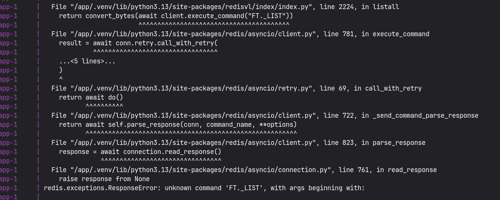
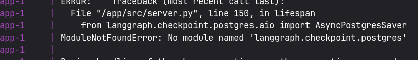
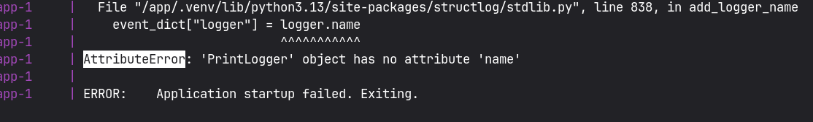
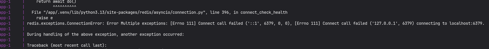

# Issues Noted

## 1. Redis Stack / RediSearch Compose Drift

`docker-compose.dev.yml` had drifted from current app requirements; local runs depend on Redis Stack / RediSearch rather than plain Redis, which caused local startup to fail before the app could run correctly.

Paths: `docker-compose.dev.yml`

Resolution used: switched the Compose service from plain `redis:7-alpine` to Redis Stack and updated the command to `redis-stack-server`.

Evidence:

## 2. Optional Postgres Checkpoint Import Could Hard-Fail Startup

Postgres checkpointing is optional in the current setup, but startup could still hard-fail when its dependency is absent, which meant the service failed to boot even though that feature was not required.

Paths: `src/server.py`, `src/graphs/course_generation/persistence.py`

Resolution used: guarded the optional Postgres checkpointer import so missing `langgraph-checkpoint-postgres` degrades to disabled historical checkpointing instead of aborting startup.

Evidence:

## 3. Structlog Logger Factory Mismatch

The structlog configuration expected stdlib logging semantics, while the configured logger factory did not match, which caused an immediate startup crash instead of normal logging.

Paths: `src/server.py`

Resolution used: replaced `structlog.PrintLoggerFactory()` with `structlog.stdlib.LoggerFactory()`.

Evidence:

## 4. Docker Env Defaults Pointed at `localhost`

The Docker env defaults were misleading for containerized runs because `localhost` does not resolve to the intended service, which made the app fail to reach its dependencies during local runs.

Paths: `.env.example`, `src/server.py`, `docs/QUICKSTART.md`, `docs/ENVIRONMENT.md`, `docs/README.md`, `docs/API_REFERENCE.md`

Resolution used: for Compose runs, used the Docker service hostname in `REDIS_URL` instead of `localhost`.

Evidence:

