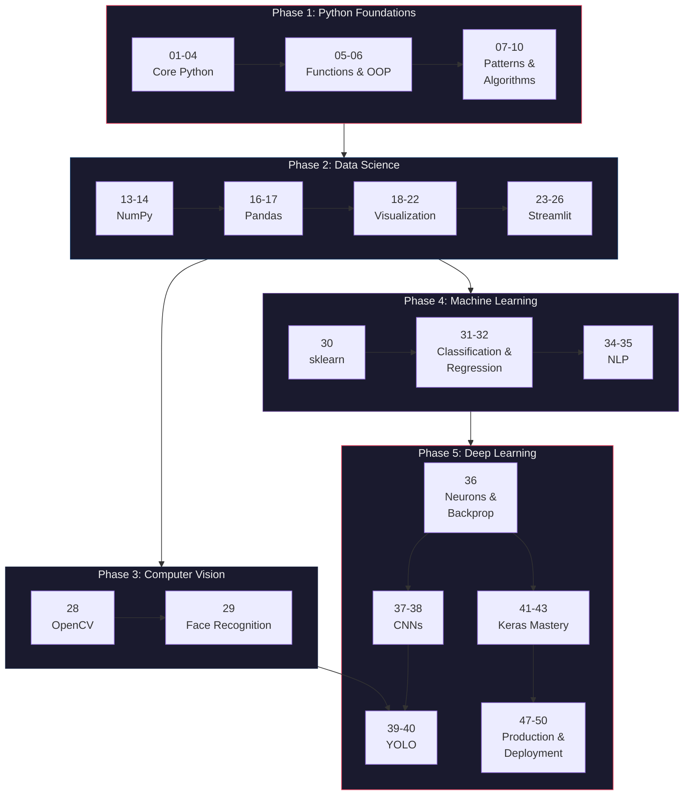

<a name="top"></a>

<p align="center">
  
  
  
  
  
</p>

<h1 align="center">The Art of Programming</h1>

<p align="center">
  <em>A complete, hands-on journey from first Python line to production deep learning.</em>
  <br>
  <em>Built for the curious mind — intuition first, math second, code always.</em>
</p>

<p align="center">
  
  
  
  
  
</p>

<p align="center">
  <a href="#the-curriculum">Curriculum</a> &nbsp;&bull;&nbsp;
  <a href="#the-teaching-philosophy">Philosophy</a> &nbsp;&bull;&nbsp;
  <a href="#getting-started">Get Started</a> &nbsp;&bull;&nbsp;
  <a href="#learning-path">Learning Path</a> &nbsp;&bull;&nbsp;
  <a href="#for-students">Students</a> &nbsp;&bull;&nbsp;
  <a href="#community-projects">Projects</a> &nbsp;&bull;&nbsp;
  <a href="#contributing">Contributing</a>
</p>

---

## What is this?

This is the companion repository for [SkillBrain](https://skillbrain.com/)'s **Introduction to AI with Python** certified course — and much more. What started as course materials has grown into a standalone toolkit for anyone learning Python, data science, and AI engineering.

Every script is **self-contained and runnable**. No chasing imports across files. No hidden setup. Clone it, pick a module, run it, and learn.

> [!TIP]
> You don't need to follow the modules in order. Each script works independently. Jump to whatever interests you.

---

## The Teaching Philosophy

This isn't a reference manual. Every module is built around a set of principles that make concepts **stick**:

| Principle | What it means in practice |
|:----------|:--------------------------|
| **Intuition first** | Every concept starts with an everyday analogy *before* any math or code |
| **Build from scratch** | NumPy implementations come *before* Keras — you see every moving part |
| **Complete pipelines** | Load &rarr; Explore &rarr; Preprocess &rarr; Train &rarr; Evaluate &rarr; Visualize |
| **Print-driven narrative** | Print statements guide you through discovery, not just display output |
| **Show what fails** | We deliberately break things to understand *why* they work |
| **Progressive complexity** | Simple &rarr; Medium &rarr; Complex within each script |

<details>
<summary><strong>Example: How we teach neurons</strong></summary>

&nbsp;

Before any code, we ask a question everyone can answer:

> *"Should I go outside today?"*
>
> You consider: Is it sunny? Is it warm? Do I have free time?
> But not all factors matter equally — sunny matters a lot, free time is essential...
> You mentally "score" the day. If the score passes a threshold — you go outside.
>
> **This is exactly what a neuron does.**

Then we build it in raw NumPy. Then we break it with XOR. Then — and only then — we use TensorFlow.

</details>

---

## The Curriculum

### Phase 1 — Python Foundations

Building strong fundamentals. No shortcuts.

| # | Module | Focus |
|:-:|--------|-------|
| 01 | **Python Intro** | Variables, types, first programs |
| 02 | **Decisions & Conditionals** | if/elif/else, boolean logic |
| 03 | **Loops** | while, for, iteration patterns |
| 04 | **Collections** | Lists, dicts, tuples, sets |
| 05 | **Functions** | Parameters, returns, scope, recursion |
| 06 | **OOP** | Classes, inheritance, polymorphism |
| 07 | **Recapitulare** | Comprehensive review |
| 08 | **Design Patterns** | Factory, Singleton, Observer, Strategy |
| 09 | **Data Structures** | Stacks, queues, trees, graphs |
| 10 | **Algorithms** | Sorting, searching, optimization |

### Phase 2 — Data Science Toolkit

The tools every data scientist reaches for daily.

| # | Module | Focus |
|:-:|--------|-------|
| 13–14 | **NumPy** | Arrays, broadcasting, vectorization, dimensions |
| 16–17 | **Pandas** | DataFrames, cleaning, grouping, merging |
| 18–19 | **Matplotlib** | Plots, subplots, customization |
| 20–21 | **Seaborn** | Statistical visualization, heatmaps, distributions |
| 22 | **Plotly** | Interactive charts and dashboards |
| 23–26 | **Streamlit** | Building data apps and ML demos |

### Phase 3 — Computer Vision

Teaching machines to see.

| # | Module | Focus |
|:-:|--------|-------|
| 28 | **OpenCV** | Image processing, filters, edge detection, contours |
| 29 | **Face Recognition** | Detection, landmarks, biometric verification |

### Phase 4 — Machine Learning

From first principles to production models.

| # | Module | Focus |
|:-:|--------|-------|
| 30 | **scikit-learn** | Math foundations &rarr; first ML model &rarr; real-world health data |
| 31 | **Classification** | Decision trees, random forests, SVM, ensemble methods |
| 32 | **Regression** | Linear, polynomial, regularization, feature engineering |
| 34–35 | **NLP & NLTK** | Tokenization, stemming, TF-IDF, sentiment analysis |

### Phase 5 — Deep Learning

Where intuition meets neural networks.

| # | Module | Focus |
|:-:|--------|-------|
| 36 | **Deep Learning** | The neuron from scratch, backpropagation, first TensorFlow model |
| 37–38 | **CNN & Transfer Learning** | Convolution from analogy to code, Fashion-MNIST, MobileNetV2 |
| 39–40 | **YOLO & Real-time Detection** | Object detection, custom training, live inference |
| 41–42 | **Keras Mastery** | model.compile() decoded, architecture design, callbacks |
| 43 | **Advanced Keras** | Functional API, multi-input models, experiment design |
| 44–46 | **Complete Projects** | End-to-end Keras projects *(in development)* |
| 47 | **Ultra-Advanced Keras** | Fine-tuning, FastAPI serving, cloud deployment |
| 48–50 | **Deployment & Scaling** | From notebook to production — Streamlit, FastAPI, GCP |

---

## Learning Path



---

## Getting Started

### Prerequisites

- Python 3.10 or higher
- A terminal and a text editor (VS Code recommended)
- Curiosity

### Installation

```bash
git clone https://github.com/LaoWater/art-of-programming.git
cd art-of-programming
python -m venv .venv
```

Activate the virtual environment:

```bash
# Windows
.venv\Scripts\activate

# macOS / Linux
source .venv/bin/activate
```

Install dependencies:

```bash
pip install -r requirements.txt
```

### Run any module

Every script is self-contained. Pick one and run it:

```bash
python 36_Deep_Learning/1_the_neuron.py
```

Scripts include `input("Press Enter...")` pauses between sections so you can read the output and absorb each concept before moving on.

---

## Repository Structure

```
art-of-programming/
│
├── 01_python_intro/              # Phase 1: Python Foundations
├── 02_decisions_conditionals/
├── ...
├── 10_advanced_algorithms/
│
├── 13-14_NumPY/                  # Phase 2: Data Science
├── 16-17_Pandas/
├── ...
├── 23-26_Streamlit/
│
├── 28_ComputerVision_OpenCV/     # Phase 3: Computer Vision
├── 29_FaceRecognition_.../
│
├── 30_sklearn/                   # Phase 4: Machine Learning
├── 31_advanced_classification/
├── 32_advanced_regression/
├── 34-35_NLP_and_nltk/
│
├── 36_Deep_Learning/             # Phase 5: Deep Learning
├── 37-38_CNN_and_TransferLearning/
├── 39-40_YOLO_.../
├── 41-42_Keras_Mastery/
├── 43_Advanced_Keras/
├── 44-46_Keras_Complete_Projects/
├── 47_Ultra-Advanced_Keras_.../
├── 48-50_Deployment_.../
│
├── Students Tasks/               # Student submissions
├── Webinar/                      # Live session materials
├── LifeChanging_Guides/          # Supplementary guides
├── DjBlue/                       # Companion project
│
└── requirements.txt
```

Each module folder typically contains:
- Numbered scripts (`1_concept.py`, `2_application.py`, ...) — progressive complexity
- A `tasks/` subfolder with assignments in Romanian + English
- Generated `.png` visualizations from script output

---

## For Students

### Submitting tasks

Your completed assignments go into the `Students Tasks/` directory under your name. A simple `git pull` gives everyone access to working reference solutions alongside the task descriptions.

### How scripts are designed

Every script follows the same pattern — you'll quickly feel at home:

```
╔══════════════════════════════════════╗
║  PART 1: ANALOGY / INTUITION        ║  ← Understand the "why"
╠══════════════════════════════════════╣
║  PART 2: BUILD FROM SCRATCH         ║  ← NumPy, raw Python
╠══════════════════════════════════════╣
║  PART 3: USE THE FRAMEWORK          ║  ← Keras / sklearn
╠══════════════════════════════════════╣
║  PART 4: VISUALIZE & EVALUATE       ║  ← Plots saved as PNG
╠══════════════════════════════════════╣
║  PART 5: EXPERIMENT & BREAK THINGS  ║  ← What fails and why
╚══════════════════════════════════════╝
```

### Datasets

All datasets are **built-in** — no downloads needed:

| Dataset | Source | Samples | Type | Used in |
|---------|--------|--------:|------|---------|
| MNIST | `keras.datasets` | 70,000 | Digit classification | Modules 36–38 |
| Fashion-MNIST | `keras.datasets` | 70,000 | Image classification | Modules 37–38 |
| CIFAR-10 | `keras.datasets` | 60,000 | Color image classification | Module 38 |
| Wine | `sklearn.datasets` | 178 | Multiclass classification | Modules 41–43 |
| Diabetes | `sklearn.datasets` | 442 | Regression | Module 42 |
| California Housing | `sklearn.datasets` | 20,640 | Regression | Modules 42–43 |

---

## Tech Stack

<p align="center">

| Layer | Tools |
|:------|:------|
| **Language** | Python 3.10+ |
| **ML / DL** | TensorFlow, Keras, scikit-learn |
| **Data** | NumPy, Pandas, SciPy |
| **Visualization** | Matplotlib, Seaborn, Plotly |
| **Computer Vision** | OpenCV, MediaPipe, YOLOv8 |
| **NLP** | NLTK, Gensim |
| **Web / Deploy** | Streamlit, FastAPI, Uvicorn |
| **Infrastructure** | Git, GCP *(deployment modules)* |

</p>

---

## Community Projects

What happens when course concepts meet real ambition. Projects that grew beyond assignments into fully packaged, deployable products — and the platform that ties it all together.

---

### Python Blueprint Bridge — The Course Platform

> *Where the lessons actually live.*

The full front-end platform powering this course — a web-based learning environment with an in-browser IDE, authentication, guided lessons anchored in real-world scenarios, group project spaces, and supplementary guides. Deployed on Google Cloud and built to make every module in this repo immediately accessible.

[](https://github.com/LaoWater/python-blueprint-bridge)
[](https://github.com/LaoWater/python-blueprint-bridge)
[](https://blue-pigeon-460611.nw.r.appspot.com/)

<details>
<summary><strong>Platform features</strong></summary>

&nbsp;

| Feature | Description |
|:--------|:------------|
| Web IDE | In-browser Python editor — no local setup needed |
| Lesson Engine | Structured lessons tied to real-world applications |
| Auth & Profiles | User accounts, progress tracking |
| Group Projects | Collaborative spaces for team assignments |
| Guides | Supplementary walkthroughs and references |
| Deployment | Google Cloud App Engine (GCP) |

| Layer | Tech |
|:------|:-----|
| Frontend | TypeScript, React |
| Backend | Node.js, Supabase |
| Database | PostgreSQL (via Supabase) |
| Hosting | Google Cloud App Engine |

**Contributors:** [LaoWater](https://github.com/LaoWater) &nbsp;·&nbsp; [RaresKeY](https://github.com/RaresKeY)

</details>

---

### DjBlue — Ambient Harmony

> *Mood-aware AI companion for meetings, music, and mindful work.*

A PySide6 desktop application that blends real-time meeting transcription, adaptive music playback, and the BlueBird AI chat assistant — all wrapped in a cross-platform package. Born from the intersection of deep learning, audio processing, and thoughtful UX design.

<table>
<tr>
<td>

**Presentation & Website**

[](https://github.com/LaoWater/djblue-ambient-harmony)
[](https://github.com/LaoWater/djblue-ambient-harmony)

Landing page & product showcase — [dj-blue.com](https://dj-blue.com)

</td>
<td>

**Product & Packaging**

[](https://github.com/RaresKeY/dj-blue-ai)
[](https://github.com/RaresKeY/dj-blue-ai)
[](https://github.com/RaresKeY/dj-blue-ai/network/members)

Full desktop app — cross-platform build, meeting assist, transcript capture

</td>
</tr>
</table>

<details>
<summary><strong>What's under the hood</strong></summary>

&nbsp;

| Layer | Tech |
|:------|:-----|
| Desktop UI | PySide6 (Qt for Python) |
| AI / Chat | BlueBird AI assistant |
| Audio | Real-time music playback, mood detection |
| Transcription | Live meeting capture & processing |
| Packaging | Cross-platform builds (Windows, macOS, Linux) |
| Website | TypeScript, modern web stack |

**Contributors:** [RaresKeY](https://github.com/RaresKeY) &nbsp;·&nbsp; [GigioneRadu](https://github.com/GigioneRadu) &nbsp;·&nbsp; [anitlo](https://github.com/anitlo) &nbsp;·&nbsp; [cosmin20089493](https://github.com/cosmin20089493)

</details>

> [!NOTE]
> Have a project that grew out of this course? Open a PR or reach out — this section is for you.

---

## Contributing

This is an evolving, living repository. Contributions are welcome — whether it's fixing a typo, adding a new module, or improving an existing explanation.

```
1. Fork the repository
2. Create a feature branch (git checkout -b feature/your-improvement)
3. Make your changes
4. Submit a pull request
```

> [!NOTE]
> If you're a student in the SkillBrain course, you can submit task solutions directly via PR to the `Students Tasks/` directory.

---

## Acknowledgments

Built in collaboration with [SkillBrain](https://skillbrain.com/) for the *Introduction to AI with Python* certified course.

This project wouldn't exist without the students who ask hard questions, break things in creative ways, and push every script to be clearer than the last.

---

<p align="center">
  <sub>173 commits and counting &nbsp;·&nbsp; Started September 2025 &nbsp;·&nbsp; Built with patience and too much coffee</sub>
</p>

[&uarr; Back to top](#top)
